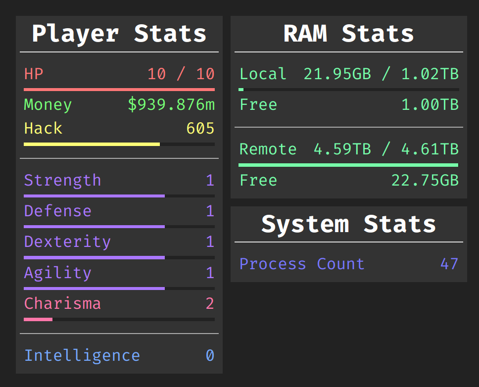

# [@bitburner-monorepo](../../README.md)/(ws-stats-viewer)[#]
This project contains the viewer-side of my external Bitburner GUI. For now, only shows the in-game stats and a few extras, but should be easy to expand in the future.

## Build Instructions
0. Make sure that all the usage prerequisites listed in the main repository's [README.md](../../README.md) are fulfilled.
1. Run the command `nx run ws-stats-viewer:build:production`.

That's it. All the files needed to use this project should now exist in the `dist/ws-stats-viewer` folder in the base directory of this repository.

## Usage Instructions
1. Ensure the [WebSockets Stats Server](../ws-stats-server/README.md) is running.
2. Ensure `/bin/svc/wsStatsConnecter.js` from my [Bitburner Scripts](../bitburner-scripts/README.md) repository is running in-game.
3. Serve the contents of `dist/ws-stats-viewer` with the desired web server.
    - Alternately, just open `dist/ws-stats-viewer/index.html` in a web browser.
